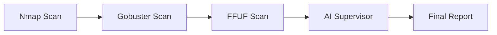

# ⚡ HackOps Recon: Scan. Exploit. Own. ⚡

Welcome to **HackOps Recon**, an autonomous, LLM-powered cybersecurity scanner built to **identify vulnerabilities**, **exploit weaknesses**, and **automate security assessments** in a seamless, efficient, and hacker-inspired manner. This tool runs a series of advanced scans and generates **AI-driven security reports**, all while ensuring maximum stealth and control.

## 🔥 Why HackOps Recon?

In the world of cybersecurity, speed and accuracy are critical. HackOps Recon combines cutting-edge tools like **Nmap**, **Gobuster**, and **FFUF**, alongside **AI-powered analysis** to empower security researchers, pentesters, and hackers with:

- **Real-time Cyber Scan Operations**
- **AI-Powered Vulnerability Analysis**
- **Stateful Attack Workflows**
- **Adaptive Retry Mechanisms**
- **Scan Logging & Reporting**
- **Hacky Terminal UI for the True Hacker Feel**

HackOps Recon brings together the best of both worlds—*powerful tools, cutting-edge AI, and autonomous agentic workflows.*

---

## 💻 Features

- **Agentic Workflow Engine**: Powered by **LangGraph**, our stateful workflow orchestrator manages complex scan sequences with dynamic adaptation.
- **Port Scanning**: Perform a stealthy scan using **Nmap** to identify open ports on the target system.
- **Web Directory Enumeration**: Use **Gobuster** to brute force web directories and uncover hidden entry points.
- **Hidden Endpoint Discovery**: **FFUF** fuzzes for web application vulnerabilities, discovering sensitive and hidden endpoints.
- **AI Vulnerability Analysis**: After scans, HackOps Recon leverages **LLM-powered AI** (via **Groq**) to analyze the results and provide a concise, actionable report on the vulnerabilities.
- **Stateful Execution**: Maintains scan context across tools with intelligent state passing between nodes.
- **Scan Logging**: Every scan is logged for future reference and accountability. Raw outputs are saved to a `scanLog.txt` file, and final results are written to `FinalReport.md`.
- **Retry Mechanism**: Failsafes in place for retries with alternate parameters, ensuring your scans continue even if an error occurs.
- **Hacky Terminal UI**: Custom terminal-style user interface in **Streamlit** to give you that authentic hacker vibe while scanning.

---

## 🔧 Getting Started

Clone the repository and navigate into the project directory:

```bash
git clone https://github.com/yourusername/hackops-recon.git
cd hackops-recon
```

### Setting up a Virtual Environment

It is recommended to use a virtual environment to manage dependencies.

```bash
# Create a virtual environment
python -m venv venv

# Activate the virtual environment
# On Windows:
venv\Scripts\activate

# On macOS/Linux:
source venv/bin/activate
```

### Install Dependencies

```bash
pip install -r requirements.txt
```

### Set up Environment Variables

You'll need a **Groq API key** to enable AI-powered analysis. Get your API key from [Groq](https://groq.ai) and save it in a `.env` file as follows:

```bash
GROQ_API_KEY=your-api-key-here
```

---

## ⚙️ How to Use

1. **Run the app**:

```bash
streamlit run app.py
```

2. **Configure Scan Settings**:

    - **TARGET**: The target domain you wish to scan (e.g., `example.com`).
    - **ALLOWED DOMAINS**: Define which domains are allowed for scanning. Targets outside the allowed domains will trigger a **safety alert**.

3. **Initiate the Cyber Scan**: Press the **"🚀 INITIATE CYBER SCAN"** button to begin scanning the target.

4. **Monitor the Scan**: Watch live progress and terminal-style output as each step (Nmap, Gobuster, FFUF) is executed.

5. **Receive Your Report**: After the scan completes, you'll receive a detailed analysis report highlighting vulnerabilities, suspicious ports, directories, and recommendations for further investigation.

---

## 🧠 Agentic Framework Architecture

HackOps Recon's brain is powered by LangGraph - a stateful workflow engine that orchestrates complex security operations:


# Key Components:

- **Stateful Workflow**: Maintains context between scan stages using shared state objects
- **Adaptive Nodes**: Each tool (Nmap/Gobuster/FFUF) runs as independent nodes with failure recovery
- **AI Supervisor**: Final node that analyzes aggregated results using Groq's LLM
- **Conditional Flows**: Dynamic path selection based on scan results (e.g., skip web scans if no web ports open)

---

## 🧐 AI-Powered Vulnerability Analysis

Once the tools have completed their scans, HackOps Recon's **AI Supervisor** takes over. It analyzes the raw scan outputs using **Groq's LLM** to generate a **concise report** that identifies:

- **Vulnerabilities**: Any open ports, exposed endpoints, or insecure configurations.
- **Suspicious Activity**: Anomalies or unusual findings from the scans.
- **Recommendations**: Actionable steps to secure the system and mitigate threats.

This ensures that you don't just get scan results, but a **clear, actionable vulnerability report** to improve security.

---

## 📊 Scan Workflow

1. **Nmap Scan**: Initial reconnaissance to identify open ports on the target.
2. **Gobuster Scan**: Directory brute-forcing for hidden directories on web servers.
3. **FFUF Scan**: Fuzzing hidden endpoints and directories for web vulnerabilities.
4. **AI Analysis**: Groq's LLM processes the scan results and generates a concise security report.

---

## 📊 Scan Metrics

HackOps Recon tracks critical scan metrics such as:

- **Total Duration**: How long the entire scan took.
- **AI Processing Time**: The time taken by the AI for vulnerability analysis.
- **Data Throughput**: The scan data's throughput during execution.

---

## 🔒 Security First

HackOps Recon operates with **safety protocols** to ensure you only scan **allowed** targets. If an out-of-scope target is detected, a **safety alert** is triggered, and the scan will not proceed.

---

## 🔗 Related Projects

- [Nmap](https://nmap.org/)
- [Gobuster](https://github.com/OJ/gobuster)
- [FFUF](https://github.com/ffuf/ffuf)

---

## ⚠️ Warning

**HackOps Recon** should only be used for legal and ethical purposes. Make sure to have explicit permission before scanning any system. Unauthorized use of this tool can result in severe legal consequences.

---

## 👾 Show Some Love

If you like HackOps Recon, star the repo! 🔥 If you find any bugs or want to contribute, feel free to **open an issue** or **create a pull request**.

---

Happy Hacking! 🚀

