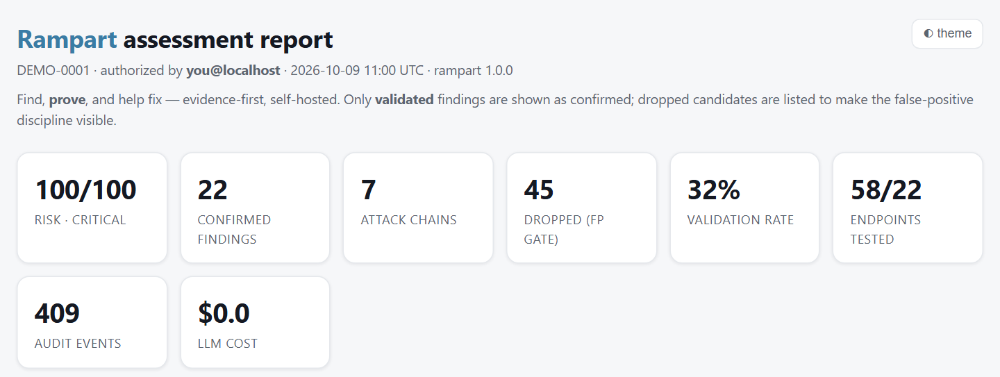
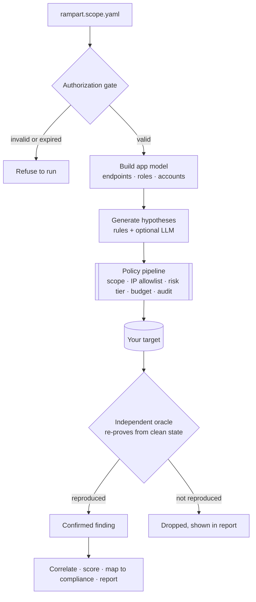

<div align="center">


# Rampart

**Find it. Prove it. Fix it.**

The open-source, self-hosted security agent for web apps, APIs, and LLM endpoints.<br />
It reports only the vulnerabilities it can **prove**, with a reproducible exploit for each one.

[](https://github.com/NitinReddy-A/Rampart/actions/workflows/ci.yml)
[](https://github.com/NitinReddy-A/Rampart/actions/workflows/codeql.yml)
[](https://scorecard.dev/viewer/?uri=github.com/NitinReddy-A/Rampart)
[](https://github.com/NitinReddy-A/Rampart/releases/latest)
[](pyproject.toml)
[](pyproject.toml)
[](#benchmark)
[](LICENSE)

[Quickstart](#quickstart) ·
[Scan your app](#scan-your-own-app) ·
[Integrations](#ways-to-use-rampart) ·
[What it tests](#what-it-tests) ·
[How it works](#how-it-works) ·
[FAQ](#faq) ·
[Docs](#documentation)



</div>

---

## What is Rampart?

Rampart is a security scanner that behaves like a careful pentester. You point it at an app you're
allowed to test. It maps the endpoints, tries dozens of attack classes, and then **re-proves every
hit from a clean state** before calling it a finding. Anything it can't reproduce is thrown out and
shown in the report, so you can see the noise it filtered for you.

It runs on your machine or in your CI, it has **zero runtime dependencies** (pure standard-library
Python), and an LLM is **optional**. With no LLM it's free, offline, and deterministic.

**Who it's for**

- **Developers** who want a security gate in CI that doesn't cry wolf.
- **AppSec teams** who need evidence, not a 400-row spreadsheet of "possible" issues.
- **Pentesters** who want the repetitive 80% automated and audited, so they can spend time on the hard 20%.
- **Teams preparing for an audit** (SOC 2, ISO 27001, PCI DSS, and others) who need control evidence mapped to findings.

> [!IMPORTANT]
> Rampart is for **authorized testing only**: assets you own or have written permission to test.
> It enforces this. It won't send a single request without a valid, unexpired scope contract that
> covers the target.

## Why Rampart

| | Typical scanner | Hosted "AI pentest" service | **Rampart** |
| --- | :---: | :---: | :---: |
| Every finding re-proved by an independent oracle | ✗ | varies | **✓** |
| False positives shown, not just hidden | ✗ | ✗ | **✓** |
| Runs fully on your infrastructure | ✓ | ✗ | **✓** |
| Works with no LLM (free, offline, reproducible) | ✓ | ✗ | **✓** |
| Optional LLM reasoning (Claude Code, OpenAI-compatible, Ollama) | ✗ | ✓ | **✓** |
| Hard scope enforcement on every request | partial | varies | **✓** |
| Tamper-evident audit log of everything it did | ✗ | varies | **✓** |
| Findings mapped to 8 compliance frameworks | rarely | varies | **✓** |
| Open source, Apache-2.0 | some | ✗ | **✓** |

## Quickstart

**See it work in about a minute.** Rampart ships an intentionally vulnerable demo app. Everything
runs on `127.0.0.1` and nothing touches the internet.

```bash
git clone https://github.com/NitinReddy-A/Rampart.git
cd Rampart
python -m venv .venv && source .venv/bin/activate      # Windows: .venv\Scripts\activate
pip install -e .
python scripts/demo.py
```

The demo starts the target, runs a full assessment, and opens an HTML report:

```text
    [CRITICAL] OS command injection via 'host' on GET /api/ping  (CONFIRMED)
    [CRITICAL] JWT accepted without signature verification (alg=none) on GET /api/me  (CONFIRMED)
    [  HIGH] SQL injection in 'id' on GET /api/products  (CONFIRMED)
    [  HIGH] Broken function-level authorization on GET /api/reports/orders  (CONFIRMED)
    [  HIGH] SQL injection in 'q' on GET /api/search  (Dropped)
    [MEDIUM] Reflected cross-site scripting (XSS) in 'id' on GET /api/products  (Dropped)
    ...
  audit chain: intact · 409 events · cost $0.0
```

On the bundled target that's **22 confirmed findings, 45 candidates dropped** by the
false-positive gate, and 7 multi-step attack chains.

The **Dropped** rows are the point. Broad enumeration also guessed SQLi on `q` and XSS on `id`;
the independent oracle couldn't reproduce them, so they're discarded. Run the same scan against the
patched build (`python benchmarks/run_benchmark.py`) and Rampart confirms nothing at all.

## Install

Pick whichever fits your workflow. All of them run the same engine.

| Method | Command |
| --- | --- |
| **pipx** (recommended for the CLI) | `pipx install https://github.com/NitinReddy-A/Rampart/releases/download/v1.2.0/rampart_appsec-1.2.0-py3-none-any.whl` |
| **pip** (CLI + Python SDK) | `pip install https://github.com/NitinReddy-A/Rampart/releases/download/v1.2.0/rampart_appsec-1.2.0-py3-none-any.whl` |
| **Docker** | `docker pull ghcr.io/nitinreddy-a/rampart:1.2.0` |
| **From source** | `git clone https://github.com/NitinReddy-A/Rampart.git && pip install -e ".[dev]"` |

The release wheel URL needs no git and works in slim CI images. Every release is listed on the
[Releases](https://github.com/NitinReddy-A/Rampart/releases/latest) page.

Requires **Python 3.10+**. Optional extras add features but never change the core:

```bash
pip install "rampart-appsec[browser] @ https://github.com/NitinReddy-A/Rampart/releases/download/v1.2.0/rampart_appsec-1.2.0-py3-none-any.whl"
python -m playwright install chromium    # DOM / stored XSS in a real headless browser
```

| Extra | Adds |
| --- | --- |
| `yaml` | PyYAML for scope parsing (a strict built-in parser is used otherwise) |
| `browser` | Playwright for DOM and stored XSS |
| `grpc` | gRPC reflection and per-RPC checks |
| `all` | everything above |

### Verifying a release

Every release is built by this repository's [release workflow](.github/workflows/release.yml), not
on anyone's laptop, and published as an [immutable release](https://docs.github.com/repositories/releasing-projects-on-github/about-releases)
(its files and tag can never be changed afterwards). Each one ships the wheel, the sdist,
`SHA256SUMS`, an SPDX SBOM, and [Sigstore](https://www.sigstore.dev/)-signed build-provenance
attestations for both the Python packages and the Docker image:

```bash
gh release download v1.2.0 --repo NitinReddy-A/Rampart
sha256sum -c SHA256SUMS
gh attestation verify rampart_appsec-1.2.0-py3-none-any.whl --repo NitinReddy-A/Rampart
gh attestation verify oci://ghcr.io/nitinreddy-a/rampart:1.2.0 --repo NitinReddy-A/Rampart
```

## Scan your own app

Three steps: write a scope contract, validate it, run the scan.

**1. Describe what you're allowed to test.** Copy the example contract and fill it in:

```bash
curl -fsSLo rampart.scope.yaml \
  https://raw.githubusercontent.com/NitinReddy-A/Rampart/main/rampart.scope.example.yaml
```

```yaml
apiVersion: security-agent/v1
kind: EngagementScope
authorization:
  owner: "team-payments@acme.example"       # who is accountable
  authorized_by: "ciso@acme.example"         # who granted permission
  attestation: "Acme owns staging.acme.internal and authorizes this test."
  expires: "2026-12-31T23:59:59Z"            # the contract expires, and Rampart stops
scope:
  in_scope:
    - host: "staging.acme.internal"
      ports: [443]
      paths_include: ["/api/**"]
  resolved_ip_allowlist: ["10.20.0.0/24"]    # checked against the resolved IP on every request
```

**2. Check it.** This validates the contract without sending anything to the target:

```bash
rampart init --scope-file rampart.scope.yaml
```

**3. Scan.**

```bash
rampart test \
  --scope-file rampart.scope.yaml \
  --target https://staging.acme.internal \
  --crawl \
  --report html,json,sarif
```

Open `.rampart/reports/report.html`. That's it.

<details>
<summary><b>Make it smarter: grey-box and white-box inputs</b></summary>

<br />

Rampart works black-box with just a URL. Give it more context and it finds more:

| Add | Flag | What you get |
| --- | --- | --- |
| An OpenAPI spec | `--openapi openapi.json` | every endpoint and parameter, without crawling |
| Test accounts | `test_accounts` in the scope file + `--secrets secrets.json` | authenticated testing, IDOR/BOLA across users |
| Object ownership | `--appmodel-seed seed.json` | precise cross-tenant access checks |
| Your source code | `--repo .` | SAST, secrets, SCA, IaC, and runtime↔source correlation |

Test-account credentials are never written in the scope file. It holds a reference
(`secret_ref: "vault://eng/user_a"`), resolved from a local `secrets.json` or your secrets manager.
See [`examples/demo_target`](examples/demo_target) for a complete grey-box setup.

</details>

## Ways to use Rampart

Every surface goes through the same engine and the same safety checks, so a scan from the CLI,
your code, your CI, or an AI agent produces identical findings.

| | Use it when |
| --- | --- |
| [**CLI**](#cli) | you're running scans by hand or in a script |
| [**Python SDK**](#python-sdk) | you want scans inside tests, notebooks, or your own tooling |
| [**GitHub Action**](#github-actions) | you want a security gate and PR comments on every pull request |
| [**GitLab CI**](#gitlab-ci) | your pipelines live in GitLab |
| [**Docker**](#docker) | you don't want Python on the host, or you're running in Kubernetes/CI runners |
| [**MCP server**](#claude-code-cursor-and-other-mcp-clients) | you want Claude Code, Cursor, or another agent to run scoped scans for you |
| [**Dashboard**](#local-dashboard) | you want to browse runs and findings in a browser |

### CLI

Run everything with `test`, or run one capability on its own:

```bash
rampart test     --target … --scope-file …   # the full assessment (start here)
rampart pipeline --target … --repo .         # everything, correlated across runtime and source
rampart recon    --target …                  # map the attack surface only
rampart dast     --target …                  # black-box web/API checks
rampart api      --target … --openapi …      # API-focused, grey-box
rampart sast     --repo .                    # source + secrets (offline; never contacts a target)
rampart sca      --repo . --sca-online       # dependencies vs OSV.dev, EPSS, CISA KEV
rampart iac      --repo .                    # Terraform, CloudFormation, Kubernetes, Dockerfile
rampart llm-test --target … --chat-path /chat       # OWASP LLM Top 10 probes (4 categories: LLM01/05/07/02)
rampart retest   --work-dir .rampart         # replay confirmed findings against a patched build
rampart features                             # list every capability and how to run it
```

`sast`, `sca`, and `iac` still require a valid scope contract, but never send a request.

**Go deeper on what it finds.** Add `--deep` and a *confirmed* finding drives the scan harder,
the way an assessor would: the other injection classes on a parameter proven to be a live sink,
sibling endpoints that return an object type proven to have a broken ownership check. Every
follow-up is re-proven by the same independent oracle, so `--deep` finds *more*, never noisier.
The fan-out is deterministic and hard-capped (depth, total, and per-finding), with duplicates
removed, so it can't run away — the counts admitted and dropped are in the report.

```bash
rampart pipeline --target … --scope-file … --deep     # the full, result-driven deep scan
```

**In CI**, gate the build with `--ci --fail-on high` (confirmed runtime findings) and, optionally,
`--fail-on-static high` (source, dependency, and IaC findings, which are evidence-backed but not
exploit-proven). Exit codes are stable:

| Exit | Meaning |
| :---: | --- |
| `0` | completed; nothing at or above the gate |
| `1` | completed; a finding breached the gate (or `retest` found something still vulnerable) |
| `2` | refused or incomplete: invalid/expired scope, target out of scope, target unreachable, every request blocked, or invalid input |

A scan that couldn't actually test anything always exits `2`, so it can never pass a gate by
accident.

### Python SDK

```python
from rampart import Rampart

result = Rampart(scope="rampart.scope.yaml", target="https://staging.acme.internal").scan()

print(result.summary())  # "7 confirmed (2 high, 4 medium, 1 low), 4 dropped by the false-positive gate"
for finding in result.confirmed:
    print(finding.severity, finding.title)

result.save(["html", "sarif"])  # or result.to_json(), to_markdown(), to_compliance() …
```

A security gate is one assertion in your test suite:

```python
def test_staging_has_no_high_severity_vulnerabilities():
    result = Rampart(scope="rampart.scope.yaml", target=STAGING_URL).scan()
    assert not result.failed(on="high"), result.summary()
```

Full API: [docs/SDK.md](docs/SDK.md).

### GitHub Actions

```yaml
# .github/workflows/security.yml
name: Security
on: [pull_request]

permissions:
  contents: read
  pull-requests: write          # only needed for comment-pr

jobs:
  rampart:
    runs-on: ubuntu-latest
    steps:
      - uses: actions/checkout@v7
      # …deploy or start the app you're testing…

      - uses: NitinReddy-A/Rampart@v1
        with:
          target: https://staging.acme.internal
          scope-file: rampart.scope.yaml
          openapi: openapi.json      # optional; without it the site is crawled
          fail-on: high              # fail the check on a confirmed high or critical
          comment-pr: true           # sticky findings summary on the PR

      - uses: actions/upload-artifact@v6
        if: always()
        with:
          name: rampart-report
          path: .rampart/reports/
```

| Input | Default | Description |
| --- | --- | --- |
| `target` | (required) | Authorized base URL to test |
| `scope-file` | `rampart.scope.yaml` | The authorization contract |
| `openapi` | | OpenAPI spec for grey-box testing |
| `crawl` | `true` | Discover endpoints by crawling |
| `secrets` | | `secrets.json` for the scope's test accounts |
| `fail-on` | `high` | `low` · `medium` · `high` · `critical` |
| `report` | `sarif,html` | Any of `html,md,json,sarif,compliance,soc2` (`json` is always added) |
| `scanners` | | Optional external tools: `nuclei,semgrep,…` or `all` |
| `args` | | Extra `rampart test` flags, e.g. `--authz --api-scan` |
| `comment-pr` | `false` | Post or update one summary comment on the PR |
| `work-dir` | `.rampart` | Where the audit log, evidence, and reports go |

`@v1` tracks the latest 1.x release. Pin to an exact tag such as `@v1.2.0`, or a full commit SHA, for fully reproducible builds.
Inputs reach the shell only through environment variables, so a value can't inject commands.

The job fails (exit 2) if the target is unreachable or every request was blocked by your scope,
so a broken deploy can never pass the security check by accident.

### GitLab CI

```yaml
rampart:
  image: python:3.12-slim
  script:
    - pip install https://github.com/NitinReddy-A/Rampart/releases/download/v1.2.0/rampart_appsec-1.2.0-py3-none-any.whl
    - rampart test --scope-file rampart.scope.yaml --target "$STAGING_URL"
        --crawl --report sarif,html,json --ci --fail-on high
  artifacts:
    when: always
    paths: [.rampart/reports/]
```

A fuller template is in [`.gitlab-ci.yml`](.gitlab-ci.yml).

### Docker

```bash
docker run --rm \
  --user "$(id -u):$(id -g)" \
  -v "$PWD:/work" \
  ghcr.io/nitinreddy-a/rampart:latest \
  test --scope-file rampart.scope.yaml --target https://staging.acme.internal --report html,sarif
```

The image is multi-arch (`amd64`, `arm64`), runs as a non-root user, and is tagged `latest`,
`1.2`, and `1.2.0`. To scan something on your host, add `--network host` on Linux or target
`host.docker.internal` on macOS and Windows. See [`docker-compose.yml`](docker-compose.yml) for a
ready-made setup.

### Claude Code, Cursor, and other MCP clients

Rampart ships an [MCP](https://modelcontextprotocol.io) server, so an AI agent can validate scope,
run scans, and read reports, always inside your scope contract.

```bash
claude mcp add rampart -- rampart mcp
```

For Cursor, Claude Desktop, or any other MCP client, add this to its MCP config:

```json
{
  "mcpServers": {
    "rampart": { "command": "rampart", "args": ["mcp"] }
  }
}
```

Then just ask: *"Check my scope file, scan http://127.0.0.1:8080, and summarize the confirmed
findings."* Tools and details: [docs/MCP.md](docs/MCP.md).

### Local dashboard

```bash
rampart serve --work-dir .rampart      # http://127.0.0.1:8787, zero dependencies
```

## What it tests

Most runtime classes below have an independent oracle — a probe, a negative control, and 2+
reproductions from a clean state — before anything is called *confirmed*. Two honest exceptions:
the out-of-band blind SSRF/XXE and the gRPC server-reflection checks confirm on one reproduction
plus a negative control (reflection is a single deterministic observation), and the built-in
misconfiguration, security-header, and sensitive-file checks are single authoritative observations
re-checked on a second request (the observation is itself the oracle). The per-class evidence tier
is spelled out in [docs/COVERAGE.md](docs/COVERAGE.md). The built-in checks need no external tools.

| Area | Checks | Turn on with |
| --- | --- | --- |
| **Web & API** | IDOR/BOLA, broken function-level authz, SQL injection, XSS, SSTI, SSRF, OS command injection, path traversal, open redirect, host-header injection, JWT `alg=none`, excessive data exposure, mass assignment, GraphQL introspection | default (`--active` for write probes) |
| **Misconfiguration** | security headers, permissive CORS, cookie flags, clickjacking, exposed files (`.env`, `.git`, backups), version disclosure | default |
| **Deep auth** | weak JWT signing secrets, expiry not enforced | `--authz` |
| **API depth** | HTTP verb tampering, GraphQL depth abuse | `--api-scan` |
| **Business logic** | price, quantity, and parameter tampering | `--bizlogic` |
| **Blind bugs** | blind SSRF and XXE via a self-hosted out-of-band collaborator | `--oob` |
| **Browser** | DOM and stored XSS in real headless Chromium | `--browser` |
| **gRPC** | reflection exposure, plaintext transport, unauthenticated RPCs | `--grpc` |
| **Infrastructure** | exposed services on in-scope hosts | `--infra` |
| **Source code** | Python AST source scanner, hard-coded secrets | `--repo` |
| **Infrastructure as code** | Terraform, CloudFormation, Kubernetes, Dockerfile | `--iac` |
| **Dependencies (SCA)** | OSV.dev matches, ranked by EPSS, CISA KEV, and call-graph reachability | `--sca-online` |
| **LLM apps** | OWASP LLM Top 10 probes — 4 of the risk categories: LLM01 prompt injection + jailbreak, LLM05 improper output handling, LLM07/LLM02 system-prompt & sensitive-info leakage | `rampart llm-test` |
| **External tools** | Nuclei, Nmap, Semgrep, Trivy, testssl.sh, imported as *unvalidated leads* | `--scanners` |

Run `rampart tools` to see which external scanners are installed.

## How it works


```mermaid
flowchart TD
    S[rampart.scope.yaml] --> G{Authorization gate}
    G -- invalid or expired --> X[Refuse to run]
    G -- valid --> M[Build app model<br/>endpoints · roles · accounts]
    M --> H[Generate hypotheses<br/>rules + optional LLM]
    H --> P[[Policy pipeline<br/>scope · IP allowlist · risk tier · budget · audit]]
    P --> T[(Your target)]
    T --> O{Independent oracle<br/>re-proves from clean state}
    O -- reproduced --> C[Confirmed finding]
    O -- not reproduced --> D[Dropped, shown in report]
    C --> R[Correlate · score · map to compliance · report]
```

Two rules make the results trustworthy:

1. **One admission contract, enforced at every egress point.** Every HTTP probe goes through one
   choke-point — the policy pipeline (`rampart/policy/pipeline.py`): scope, resolved-IP allowlist,
   risk tier, policy, and budget are checked on each request, fail-closed. The side engines that open
   their own connections (headless browser, gRPC, infra) don't route around that contract: each
   resolves and scope-checks its target against the same scope + resolved-IP allowlist itself, and
   sends every connection through a shared admission guard (`rampart/infra/sidechannel.py`) that
   applies the same budget, kill-switch, and tamper-evident audit — also fail-closed. No agent,
   scanner, or LLM output can route around it; a prompt-injected model can at most propose requests
   the policy engine rejects.
2. **Nothing is "confirmed" without independent proof.** The oracle that confirms a finding is
   deterministic code, never an LLM, and it re-derives the result from scratch with a negative
   control. LLM-reasoned issues that can't be proven are labelled `agent-assessed`.

Code layout and internals: [docs/ARCHITECTURE.md](docs/ARCHITECTURE.md).

## Bring your own LLM (optional)

The LLM only **suggests** where to look. Everything it suggests is re-checked by the deterministic
pipeline and the oracles.

| `--intel` | Uses | Cost | Setup |
| --- | --- | --- | --- |
| `deterministic` *(default)* | built-in rules | free | none |
| `claude-code` | your local `claude` CLI | your Claude plan | `claude` on your `PATH` |
| `openai-compat` | OpenAI, OpenRouter, Groq, Together, LiteLLM, Ollama… | your key, or free locally | 2–3 env vars |

```bash
export RAMPART_LLM_BASE_URL="http://localhost:11434/v1"   # e.g. a local Ollama
export RAMPART_LLM_MODEL="llama3.1"
export RAMPART_LLM_API_KEY="..."                          # or OPENAI_API_KEY; not needed for Ollama
rampart test --intel openai-compat --agents --scope-file rampart.scope.yaml --target …
```

Keys are read from the environment, never from command-line flags. Model suggestions:
[docs/LLM_AND_API_KEYS.md](docs/LLM_AND_API_KEYS.md).

## Reports and compliance

Choose any combination with `--report`:

| Format | For |
| --- | --- |
| `html` | a self-contained, shareable report (light and dark) |
| `md` | pull requests, wikis, tickets |
| `json` | your own tooling; the stable schema the SDK reads |
| `sarif` | code-scanning tools and IDEs |
| `compliance` / `soc2` | auditors |

The compliance report maps each finding by CWE to the controls it evidences across **SOC 2,
ISO 27001:2022, PCI DSS v4.0, NIST 800-53 Rev5 (FedRAMP), HIPAA, GDPR, OWASP ASVS, and CIS
Controls v8**. It's evidence for your auditor, not a certification. Pair it with the hash-chained
audit log (`rampart verify-audit`) and the evidence bundle.

## Benchmark

Most tools self-report their false-positive rate. Rampart ships the benchmark so you can check:

```bash
python benchmarks/run_benchmark.py --runs 5
```

It scans the demo target in **vulnerable** and **fixed** modes and scores confirmed findings
against ground truth. CI runs it on every push and fails the build on any false positive or false
negative.

| True positives | False positives | False negatives | Precision | Recall | Cost |
| :---: | :---: | :---: | :---: | :---: | :---: |
| 15 | 0 | 0 | 100% | 100% | $0 |

A separate weekly job scores Rampart against the external
[OWASP VAmPI](https://github.com/erev0s/VAmPI) corpus ([`corpus.yml`](.github/workflows/corpus.yml)).

> [!NOTE]
> The benchmark target ships with Rampart, so a perfect score there is a regression guarantee, not
> a claim about every application. Known gaps on other targets are listed under
> [Limitations](#limitations), and we track them openly.

## Safety model

- **Authorization gate.** No valid, unexpired, in-scope `rampart.scope.yaml` with an accountable owner means no run.
- **One admission contract on every egress.** HTTP requests (crawler, oracles, test-account logins) are checked against the scope's host, port, and canonicalised path, and the *resolved* IP to stop DNS rebinding, by the policy pipeline. The headless browser, gRPC, and infra engines open their own connections but enforce that same scope + *resolved*-IP allowlist themselves and route every connection through a shared admission guard (`rampart/infra/sidechannel.py`) that applies the same budget, kill-switch, and tamper-evident audit — all fail-closed.
- **Fail-closed scope parsing.** The built-in YAML parser rejects anything it doesn't fully understand instead of guessing, so a typo can't silently widen your scope.
- **LLM containment is tested.** A regression test drives the agent layer with a model that tries to reach other hosts, ports, excluded paths, cloud metadata, and `file://` URLs, and asserts that nothing out of scope is ever contacted.
- **Non-destructive by default.** Write probes need `--active`; state changes beyond that need human approval; destructive actions and denial of service are always denied.
- **Independent validation** before anything is marked confirmed.
- **Tamper-evident audit log.** Append-only, hash-chained, and anchored; `rampart verify-audit` detects edits, deletions, reordering, and truncation.
- **Target output is data, never instructions.** Prevents indirect prompt injection.
- **Budgets and a kill switch** cap request rate, total requests, and LLM spend.
- **Advisory fixes only.** Patch suggestions are written as files; Rampart never applies or merges them.

## FAQ

<details>
<summary><b>Is it legal to run this?</b></summary>
<br />
On systems you own or have written permission to test, yes. That's what the scope contract
records: who authorized the test, what's in scope, and when the permission expires. Running any
security scanner against systems without permission is illegal in most countries.
</details>

<details>
<summary><b>Does my code or data leave my machine?</b></summary>
<br />
Not by default. Rampart's default mode makes no external calls besides the requests to your
in-scope target. Two features are opt-in: <code>--sca-online</code> sends dependency names and
versions to OSV.dev and fetches public EPSS and CISA KEV data, and an LLM provider receives prompts
if you configure one. Use Ollama to keep
LLM reasoning local too.
</details>

<details>
<summary><b>Will it break my staging environment?</b></summary>
<br />
It's built not to. By default it only sends read requests and controlled validation probes. Write
probes require <code>--active</code>, state-changing actions require human approval, and
destructive or denial-of-service actions are always blocked. Rate and request budgets come from
your scope file. Still, test against staging rather than production.
</details>

<details>
<summary><b>How is this different from OWASP ZAP or Nuclei?</b></summary>
<br />
Those are excellent at finding <i>candidates</i>. Rampart's focus is proving them: each finding is
reproduced by an independent oracle with a negative control, and unproven candidates are dropped
and listed. Rampart can also run Nuclei, Nmap, Semgrep, Trivy, and testssl.sh as lead sources via
<code>--scanners</code>, then label their output as unvalidated.
</details>

<details>
<summary><b>Do I need an LLM or an API key?</b></summary>
<br />
No. Everything in "What it tests" works deterministically with no LLM. The optional reasoning layer
(<code>--agents</code>) helps with business-logic and multi-step auth flows.
</details>

<details>
<summary><b>What does "agent-assessed" mean?</b></summary>
<br />
An issue the LLM reasoned about but no oracle could prove. Rampart shows it separately so a human
can review it, and never counts it as confirmed or uses it to fail a build.
</details>

<details>
<summary><b>Can I add my own checks?</b></summary>
<br />
Yes. A new vulnerability class is a probe plus an oracle. <a href="CONTRIBUTING.md">CONTRIBUTING.md</a>
walks through it step by step.
</details>

## Limitations

Rampart is a strong, low-noise first pass and a continuous regression gate. It isn't a replacement
for a human pentest.

- Novel logic flaws and deep design issues still need a person. That's why LLM-only findings are labelled `agent-assessed` and never promoted automatically.
- No mobile app testing, and gRPC coverage stops at reachable unauthenticated checks (no deep fuzzing).
- No hosted service. You run it yourself.
- Compliance output is evidence of control effectiveness, not an attestation.

**Known issues in v1.2.0** (found by our own end-to-end review and being worked on):

- The OS command injection oracle can confirm an endpoint that merely echoes its input back. Treat
  a `CMDI` finding on an endpoint that reflects parameters with extra care until this is fixed.
- The path traversal, SSRF, and BFLA oracles currently recognise response signatures that the
  bundled demo produces, so they can miss these flaws on other applications (false negatives,
  not false positives).

## Documentation

| Guide | |
| --- | --- |
| [Python SDK](docs/SDK.md) | run scans from code, gate tests |
| [MCP / Claude Code](docs/MCP.md) | let an AI agent run scoped scans |
| [LLMs and API keys](docs/LLM_AND_API_KEYS.md) | providers, models, free options |
| [LLM security testing](docs/LLM_SECURITY_TESTING.md) | the 4 OWASP LLM Top 10 categories `llm-test` covers (LLM01/05/07/02) |
| [Coverage manifest](docs/COVERAGE.md) | exactly what Rampart does, by evidence tier — the single source of truth |
| [Architecture](docs/ARCHITECTURE.md) | how the code is organized |
| [Benchmark fixtures](docs/BENCHMARK_FIXTURES.md) | how ground truth is defined |
| [Changelog](CHANGELOG.md) | what changed in each release |

## Contributing

Contributions are welcome: new checks, integrations, docs, and bug reports. Start with
[CONTRIBUTING.md](CONTRIBUTING.md) for setup and the rules that keep findings trustworthy.

```bash
git clone https://github.com/NitinReddy-A/Rampart.git && cd Rampart
pip install -e ".[dev]" && pre-commit install
make check          # lint, format, tests, and the benchmark, exactly as CI runs them
```

By participating you agree to the [Code of Conduct](CODE_OF_CONDUCT.md). Found a vulnerability
*in Rampart itself*? Please report it privately via [SECURITY.md](SECURITY.md).

## License

[Apache-2.0](LICENSE). GPL/AGPL external scanners are invoked as separate processes, never linked.
See [NOTICE](NOTICE).

<div align="center">
<sub>Built by <a href="https://github.com/NitinReddy-A">Nitin</a> and the Rampart contributors. If Rampart saved you time, a ⭐ helps others find it.</sub>
</div>
